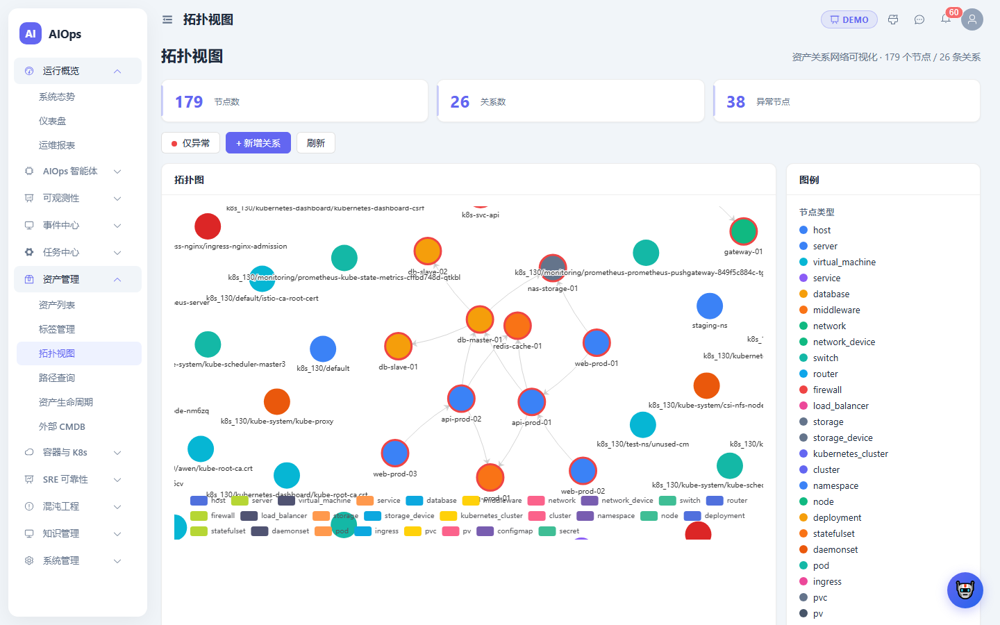
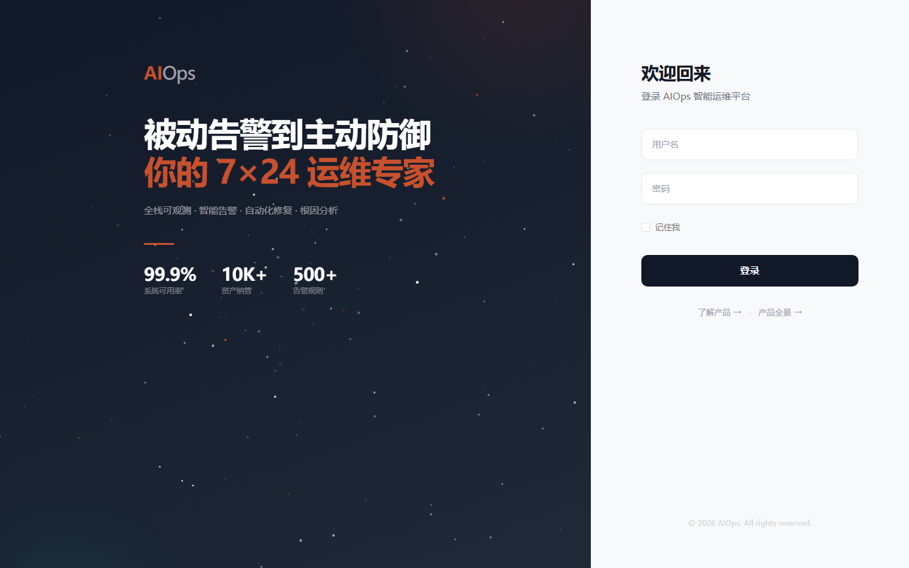

<div align="center">

<br/>


**监控 · 告警 · 根因分析 · 自动化运维 · AI Agent · SRE 可靠性**

*从「到处查系统」到「看态势、找证据、问系统、做动作」*

<br/>

<a href="https://github.com/ZF1411945427/AIOPS/stargazers"></a>
<a href="https://github.com/ZF1411945427/AIOPS/network"></a>
<a href="LICENSE"></a>


<br/><br/>

</div>

---

> ## 💡 这是什么？
>
> **AIOps** 是一个面向 SRE / DevOps 团队的 **智能运维一体化平台**。
>
> 它把碎片化的运维能力收敛成一条完整链路：
>
> ```
> 📊 可观测性取证 → 🚨 事件中心复盘 → 🤖 AI Agent 智能分析 → ⚡ 自动化动作 → 📈 SRE 持续度量
> ```

---

## ✨ 核心亮点

<table>
<tr>
<td width="50%" valign="top">

### 🖥️ 可观测性 — 360° 证据链

| 模块 | 能力 |
|------|------|
| **仪表盘** | 可配置 Dashboard，多图表组件，7×24 健康总览 |
| **指标监控** | 21 个系统指标 SSH 采集，趋势预测，异常检测 |
| **日志管理** | 日志采集，异常检测，日志聚类根因分析 |
| **链路追踪** | OTLP 接收，Jaeger 兼容，Java/Python/Go/Node/K8s 接入 |
| **拓扑发现** | 服务依赖拓扑，K8s 资源树，Service Mesh |

</td>
<td width="50%" valign="top">

### 🚨 告警与事件 — 全生命周期闭环

| 模块 | 能力 |
|------|------|
| **告警管理** | 规则配置，抑制静默，级别路由 |
| **告警聚合** | 风暴检测，自动归并，降噪 |
| **告警控制台** | 实时看板，确认/处理/关闭 |
| **事件中心** | 集群事件统计，异常事件检测，事件源配置 |
| **Webhook** | 外部系统对接，自定义回调 |

</td>
</tr>
<tr>
<td width="50%" valign="top">

### 🔍 根因分析 — 6 种算法引擎

| 算法 | 类型 | 适用场景 |
|------|------|----------|
| **PageRank** | 拓扑排序 | 从故障传播链定位关键节点 |
| **Granger** | 因果检验 | 指标间因果关系判定 |
| **DTW** | 时序相似度 | 指标曲线形态匹配 |
| **LogClu** | 日志聚类 | 日志异常模式发现 |
| **IDCE** | 异常子图 | 拓扑异常子图检测 |
| **PCADr** | 维度规约 | 高维指标降维归因 |

</td>
<td width="50%" valign="top">

### 🤖 自动化运维 — 从检测到修复

| 模块 | 能力 |
|------|------|
| **自愈规则** | 告警触发自动修复，条件+动作编排 |
| **Runbook** | 运维手册模板，步骤化排障指引 |
| **远程脚本** | SSH 批量命令执行，脚本模板管理 |
| **变更审批** | 蓝绿发布，变更工作流，审批链 |
| **通知管理** | 多渠道通知（短信/邮件/电话/Webhook） |

</td>
</tr>
<tr>
<td width="50%" valign="top">

### 📊 SRE 可靠性工程 — 完整实践闭环

| 模块 | 能力 |
|------|------|
| **错误预算** | SLO→Error Budget 映射，健康/警告/严重状态 |
| **预算消耗** | 1h/6h/24h 多窗口 Burn Rate 预警 |
| **SLO 配置** | 服务级目标管理，窗口期可配置 |
| **SLA 协议** | 达成率计算，处罚规则，运行/停机统计 |
| **值班表** | 周/月轮值排班，当前值班状态看板 |
| **升级策略** | 多级别升级，等待时间，通知渠道联动 |
| **可用性报表** | 一键生成，健康度汇总，历史趋势追踪 |

</td>
<td width="50%" valign="top">

### 💬 AI Agent — 自然语言驱动

| 能力 | 说明 |
|------|------|
| **对话排障** | 自然语言查询系统状态，多轮上下文 |
| **工具调用** | MCP 工具动态注册与编排 |
| **Skill 约束** | 输出格式标准化，行为可控 |
| **多模型** | OpenAI、Anthropic、MiniMax 等适配 |

</td>
</tr>
</table>

---

## 🏗️ 产品架构

```
┌──────────────────────────────────────────────────────────────────────┐
│                          用户体验层                                    │
│     🖥️ Vue 3 SPA     📄 Jinja2 传统页面     💬 AI 对话助手           │
├──────────────────────────────────────────────────────────────────────┤
│                            能力域                                      │
│  ┌──────────┐ ┌──────────┐ ┌──────────┐ ┌──────────┐ ┌──────────┐  │
│  │ 🔍 可观测 │ │ 🚨 告警  │ │ 🧠 根因   │ │ ⚡ 自动化 │ │ 📊 SRE  │  │
│  │ 指标/日志 │ │ 规则/静默 │ │ PageRank │ │ Remed.   │ │错误预算  │  │
│  │ Trace/拓扑│ │ 聚合/风暴 │ │ Granger  │ │ Runbook  │ │SLA/SLO  │  │
│  │ 接入指引  │ │ Webhook  │ │ DTW/IDCE │ │ 脚本执行 │ │值班升级  │  │
│  └──────────┘ └──────────┘ └──────────┘ └──────────┘ └──────────┘  │
├──────────────────────────────────────────────────────────────────────┤
│                          AI Agent 层                                   │
│     🤖 对话排障    📦 MCP 工具调用    🎯 Skill 约束    🧩 多模型适配  │
├──────────────────────────────────────────────────────────────────────┤
│                            数据层                                      │
│  📦 SQLite    🔍 Elasticsearch    ☸️ K8s API    🔑 SSH    📈 Prometheus │
└──────────────────────────────────────────────────────────────────────┘
```

---

## 🛠️ 技术栈

<div>


</div>

---

## 🚀 快速开始

```bash
# 1️⃣ 克隆项目
git clone https://github.com/ZF1411945427/AIOPS.git
cd AIOPS

# 2️⃣ 安装后端依赖 & 启动 (端口 8000)
pip install -r requirements.txt
python run.py

# 3️⃣ 新终端 — 启动前端 (端口 3000)
cd frontend && npm install && npm run dev
```

> 🔐 **默认账号**：`admin` / `admin123`
>
> 🖥️ Vue SPA → http://localhost:3000 &nbsp;|&nbsp; 📄 Jinja2 → http://localhost:8000

### 🗄️ 双数据库模式

顶栏按钮一键切换，互不影响：

| 数据库 | 场景 | 内容 |
|--------|------|------|
| `db/aiops.db` | 🎮 Demo 展示 | 内置预设演示数据 |
| `db/aiops_real.db` | 🔬 真实测试 | 空库，无残留模拟数据 |

---

## 📁 项目结构

```
AIOPS/
├── app/                           # FastAPI 后端 (81 路由 + 28 服务)
│   ├── main.py                    # 应用入口 & 中间件
│   ├── models.py                  # ORM 模型 (~30 张表)
│   ├── routers/                   # 路由模块
│   │   ├── sre.py                 # SLO / Error Budget / SLA / 值班 / 升级
│   │   ├── agent_chat.py          # AI Agent 对话
│   │   ├── pagerank_rca.py        # PageRank 根因分析
│   │   ├── trace_ingest.py        # OTLP/Jaeger 链路接收
│   │   ├── k8s_resources.py       # K8s 资源管理
│   │   └── ... (76 more)
│   ├── services/                  # 业务逻辑层
│   ├── templates/                 # 117 个 Jinja2 模板
│   ├── static/                    # 静态资源
│   └── seed_data.py               # Demo 种子数据
├── frontend/                      # Vue 3 + Vite
│   ├── src/views/                 # 14+ 页面视图
│   ├── src/layout/                # 主布局 (悬浮药丸侧边栏)
│   ├── src/stores/                # Pinia 状态管理
│   └── dist/                      # 构建产物
├── db/                            # SQLite 数据库 (demo + real)
├── tests/
│   └── e2e/                       # Playwright E2E 测试 (147 用例)
├── 功能测试/                       # 功能测试文档 & 脚本
├── sxdevops-其他人的项目，用来借鉴的/  # 参考项目
├── requirements.txt               # Python 依赖
├── run.py                         # 后端启动入口
└── README.md                      # 你正在看的这个文件 😄
```

---

## 📐 部署架构

```
┌───────────────────────────────────────────┐
│               浏览器                       │
│    :3000  Vue SPA     :8000  Jinja2        │
└─────────────────┬─────────────────────────┘
                  │
┌─────────────────▼─────────────────────────┐
│           FastAPI + Uvicorn                │
│     AuthMiddleware · SessionMiddleware      │
│     DEMO/REAL 双数据库自动切换               │
└────┬──────────┬──────────┬────────────────┘
     │          │          │
┌────▼───┐ ┌───▼────┐ ┌──▼────────┐
│ SQLite │ │   ES   │ │  SSH/K8s  │
│ (WAL)  │ │ :9200  │ │   Agent   │
└────────┘ └────────┘ └───────────┘
```

---

## 📸 系统截图

<table>
  <tr>
    <td></td>
    <td></td>
  </tr>
  <tr>
    <td align="center">📊 仪表盘 — 7 卡片 + 4 图表</td>
    <td align="center">🔗 拓扑视图 — 服务依赖关系</td>
  </tr>
  <tr>
    <td></td>
    <td></td>
  </tr>
  <tr>
    <td align="center">🤖 AI 智能助手 — 自然语言排障</td>
    <td align="center">🌡️ 系统态势 — 热力图 + SLA</td>
  </tr>
</table>

---

## 📈 功能覆盖一览

<details>
<summary><b>81 个路由模块全列表（点击展开）</b></summary>

| 分类 | 模块 |
|------|------|
| **认证 & 用户** | `auth` · `users` · `tokens` · `audit` |
| **可观测性** | `dashboard` · `dashboard_config` · `metrics` · `logs` · `log_anomaly` · `log_rca` · `traces` · `traces_api` · `trace_view` · `trace_ingest` · `trace_anomaly` · `trace_rca` · `topology` · `topo_graph` · `topology_path` · `discovery` · `netflow` · `service_mesh` |
| **告警 & 事件** | `alerts` · `alert_console` · `alert_events` · `alert_silence` · `alert_storm` · `alert_webhooks` · `events` · `event_sources` · `correlation` · `hotspot` · `cluster_anomaly` |
| **根因分析** | `pagerank_rca` · `granger` · `dtw` · `idice` · `drain` · `pcadr` |
| **自动化运维** | `remediation` · `remediation_workflow` · `runbooks` · `script_exec` · `blue_green` · `change_workflow` · `lifecycle` |
| **SRE** | `sre` · `system_posture` · `reports` · `report_schedules` |
| **AI Agent** | `agent_chat` · `ai_providers` · `chatops` · `smart_recommend` |
| **资产 & CMDB** | `assets` · `asset_changes` · `ci_models` · `ext_cmdb` · `tags` |
| **容器 & K8s** | `containers` · `k8s_resources` · `k8s_monitor` |
| **数据源 & 集成** | `datasources` · `es_integration` · `kafka_pipeline` · `feature_store` |
| **预测 & 异常** | `predictions` · `predictions_enhanced` · `prediction_models` · `trend_prediction` · `anomaly` |
| **通知** | `notifications` · `notification_templates` |
| **系统** | `system` · `settings` · `menu` · `api_v1` · `knowledge` · `knowledge_graph` |

</details>

---

## 🤝 开源协议

本项目基于 **Apache License 2.0** 开源，欢迎 [⭐ Star](https://github.com/ZF1411945427/AIOPS/stargazers) 与 [🍴 Fork](https://github.com/ZF1411945427/AIOPS/fork)。

<br/>

<div align="center">

**[⬆ 回到顶部](#)**

<sub>Built with ❤️ for SRE and DevOps teams</sub>

</div>
